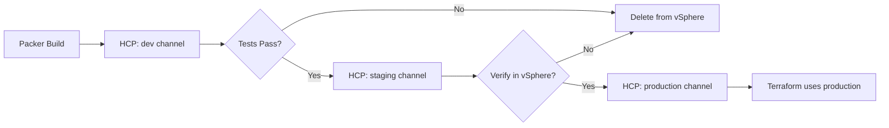

# VM Template Management with HCP Packer

This document explains how to manage VM templates when using HCP Packer with vSphere, and how to prevent errors when templates are deleted from vSphere but still referenced in HCP Packer.

## The Problem

### Error Scenario

```
Error: error fetching virtual machine: vm 'base-rhel-9-20251203085132' not found
with module.vm.data.vsphere_virtual_machine.this["base-rhel-9-20251203085132"]
```

**What's happening:**
1. HCP Packer returns a template name (e.g., `base-rhel-9-20251203085132`) via the "latest" channel
2. This template name is passed to the vSphere provider to look up the template
3. The template has been deleted from vSphere (out-of-band cleanup process)
4. The vSphere data source fails during Terraform refresh
5. Terraform cannot proceed with plan/apply

### Why This Happens

- **HCP Packer records template metadata** (names, IDs) even after templates are deleted from vSphere
- **The "latest" channel** always points to the most recent build, regardless of whether it still exists
- **Template cleanup processes** may delete old templates from vSphere to save storage
- **Terraform data sources** fail immediately when the resource doesn't exist (cannot be gracefully handled)

## Solutions

### Solution 1: Use a Stable HCP Packer Channel (Recommended)

Instead of using "latest", use a dedicated channel like "production" that only gets updated when templates are verified.

```hcl
module "vm" {
  source = "./path/to/module"

  os_type         = "linux"
  hcp_packer_channel = "production"  # Instead of "latest"

  # ... other variables ...
}
```

**HCP Packer Channel Strategy:**



**Best Practices:**
- Create separate HCP Packer channels: `dev`, `staging`, `production`
- Only promote builds to `production` after verifying they exist in vSphere
- Configure Terraform to use the `production` channel
- Implement retention policies: Don't delete templates referenced by `production`

### Solution 2: Lock to a Specific HCP Packer Iteration

For guaranteed reproducibility, lock to a specific iteration:

```hcl
module "vm" {
  source = "./path/to/module"

  os_type              = "linux"
  hcp_packer_iteration_id = "01HQEXAMPLE123456789"  # Specific build

  # ... other variables ...
}
```

**When to use this:**
- You need guaranteed reproducibility
- You want to prevent automatic template updates
- You're testing a specific build

**How to find iteration IDs:**
```bash
# Using HCP Packer CLI
packer hcp get-iteration base-ubuntu-2204 --channel production

# Using Terraform Console
terraform console
> data.hcp_packer_artifact.base_ubuntu_2204.version_fingerprint
```

### Solution 3: Use Fallback Template (Emergency Override)

When HCP Packer is problematic, manually specify a known-good template:

```hcl
module "vm" {
  source = "./path/to/module"

  os_type                 = "linux"
  fallback_template_name  = "base-ubuntu-2204-golden-v1.0"  # Manual override

  # ... other variables ...
}
```

**When to use this:**
- Emergency fix when HCP Packer is down or misconfigured
- You want to bypass HCP Packer temporarily
- You have a manually-maintained "golden image"

**⚠️  Warning:** This bypasses HCP Packer entirely. HCP Packer data sources will not be queried when a fallback is provided.

## Implementation Details

### How the Module Works

The module uses conditional data sources to prevent errors:

```hcl
# HCP Packer data sources only query when fallback is NOT provided
data "hcp_packer_artifact" "base_ubuntu_2204" {
  count = var.fallback_template_name == null ? 1 : 0  # Conditional!

  bucket_name         = "base-ubuntu-2204"
  channel_name        = var.hcp_packer_channel
  version_fingerprint = var.hcp_packer_iteration_id
  platform            = "vsphere"
  region              = "Datacenter"
}

locals {
  # Use fallback if provided, otherwise use HCP Packer
  cloud_image_id = var.fallback_template_name != null ?
    var.fallback_template_name :
    data.hcp_packer_artifact.base_ubuntu_2204[0].external_identifier
}
```

### Troubleshooting with Outputs

The module exposes template metadata for troubleshooting:

```hcl
output "template_metadata" {
  value = {
    bucket      = "base-ubuntu-2204"
    channel     = "latest"
    iteration   = "01HQEXAMPLE123456789"
    template_id = "base-ubuntu-2204-20251203085132"
  }
}
```

**Check your template info:**
```bash
terraform output template_metadata
terraform output template_name
```

## Operational Best Practices

### 1. HCP Packer Channel Management

**Create Multiple Channels:**
```bash
# Using HCP Packer UI or API
hcp packer channel create base-ubuntu-2204 --name dev
hcp packer channel create base-ubuntu-2204 --name staging
hcp packer channel create base-ubuntu-2204 --name production
```

**Promotion Pipeline:**
```bash
# After build completes
ITERATION_ID=$(packer hcp get-iteration base-ubuntu-2204 --channel dev --format json | jq -r '.id')

# Verify template exists in vSphere
if vsphere-cli template exists "base-ubuntu-2204-${ITERATION_ID}"; then
  # Promote to production
  hcp packer channel update base-ubuntu-2204 production --iteration ${ITERATION_ID}
fi
```

### 2. Template Retention Policies

**Coordinate Cleanup with HCP Packer:**

```bash
#!/bin/bash
# cleanup-vsphere-templates.sh

CHANNEL="production"

# Get template referenced by production channel
PROD_TEMPLATE=$(packer hcp get-iteration base-ubuntu-2204 --channel ${CHANNEL} --format json | jq -r '.builds[].labels.template_name')

# Delete old templates, but preserve the production one
for template in $(vsphere-cli list-templates | grep base-ubuntu-2204); do
  if [ "$template" != "$PROD_TEMPLATE" ]; then
    # Check if template is older than 30 days
    AGE=$(vsphere-cli get-template-age "$template")
    if [ "$AGE" -gt 30 ]; then
      echo "Deleting old template: $template"
      vsphere-cli delete-template "$template"
    fi
  else
    echo "Preserving production template: $template"
  fi
done
```

**Retention Rules:**
- Never delete templates referenced by `production` channel
- Keep `staging` templates for at least 7 days
- Keep `dev` templates for at least 24 hours
- Always preserve the last 3 iterations as backup

### 3. Monitoring and Alerting

**Monitor Template Availability:**

```hcl
# Add to monitoring stack
check "hcp_template_exists_in_vsphere" {
  data "vsphere_virtual_machine" "prod_template" {
    name          = data.hcp_packer_artifact.base_ubuntu_2204.external_identifier
    datacenter_id = data.vsphere_datacenter.this.id
  }

  assert {
    condition     = data.vsphere_virtual_machine.prod_template.id != ""
    error_message = "Production template missing from vSphere!"
  }
}
```

**Alert on HCP/vSphere Drift:**
```bash
# Scheduled check (cron job)
#!/bin/bash
HCP_TEMPLATE=$(packer hcp get-iteration base-ubuntu-2204 --channel production --format json | jq -r '.builds[].labels.template_name')

if ! vsphere-cli template exists "$HCP_TEMPLATE"; then
  echo "ALERT: HCP Packer references missing template: $HCP_TEMPLATE" | mail -s "Template Drift Alert" ops@example.com
fi
```

### 4. Terraform Workspace Configuration

**Development Environment (fast iteration):**
```hcl
hcp_packer_channel = "dev"  # Use latest builds
```

**Staging Environment (validation):**
```hcl
hcp_packer_channel = "staging"  # Use validated builds
```

**Production Environment (stability):**
```hcl
hcp_packer_channel     = "production"  # Use only production-ready builds
# OR lock to specific iteration
hcp_packer_iteration_id = "01HQEXAMPLE123456789"
```

## Troubleshooting Guide

### Problem: "vm 'template-name' not found"

**Quick Fix (Emergency):**
```hcl
# Add fallback template to your module call
fallback_template_name = "known-good-template-name"
terraform plan
terraform apply
```

**Proper Fix:**
1. Check which template HCP Packer is referencing:
   ```bash
   packer hcp get-iteration base-ubuntu-2204 --channel latest
   ```

2. Check if template exists in vSphere:
   ```bash
   govc vm.info "base-ubuntu-2204-20251203085132"
   ```

3. If template is missing:
   - **Option A:** Rebuild the template using Packer
   - **Option B:** Update HCP Packer channel to point to existing template
   - **Option C:** Use fallback template temporarily

4. Switch to `production` channel:
   ```hcl
   hcp_packer_channel = "production"
   ```

### Problem: "Template exists but is outdated"

**Update HCP Packer channel:**
```bash
# Build new template
packer build template.pkr.hcl

# Get new iteration ID
ITERATION_ID=$(packer hcp get-iteration base-ubuntu-2204 --channel dev --format json | jq -r '.id')

# Verify it exists in vSphere
govc vm.info "base-ubuntu-2204-${ITERATION_ID}"

# Promote to production
hcp packer channel update base-ubuntu-2204 production --iteration ${ITERATION_ID}
```

### Problem: "Want to roll back to previous template"

**Using Iteration Locking:**
```hcl
# Find previous iteration
# packer hcp list-iterations base-ubuntu-2204

# Lock to specific iteration
hcp_packer_iteration_id = "01HQPREVIOUS987654321"
```

## Advanced Patterns

### Multi-Region Template Management

```hcl
locals {
  # Different regions may have different template availability
  region_templates = {
    "us-east" = {
      datacenter = "DC1"
      channel    = "production"
    }
    "us-west" = {
      datacenter = "DC2"
      channel    = "production"
    }
  }
}

module "vm" {
  source = "./path/to/module"

  os_type            = "linux"
  site               = "sydney"
  hcp_packer_channel = local.region_templates[var.region].channel
}
```

### Blue-Green Template Deployments

```hcl
# Deploy with blue template
module "vm_blue" {
  source                  = "./path/to/module"
  hcp_packer_iteration_id = "01HQBLUE123456"
  count                   = var.active_color == "blue" ? 1 : 0
}

# Deploy with green template
module "vm_green" {
  source                  = "./path/to/module"
  hcp_packer_iteration_id = "01HQGREEN789012"
  count                   = var.active_color == "green" ? 1 : 0
}
```

## Migration Path

If you're currently using hardcoded "latest" channel:

### Phase 1: Add Channel Control (No Breaking Changes)
```hcl
# Default is still "latest", but now configurable
# No changes required to existing code
terraform plan  # Should show no changes
```

### Phase 2: Create Production Channel
```bash
# Create production channel in HCP Packer
hcp packer channel create base-ubuntu-2204 --name production

# Point it to current latest
LATEST_ITERATION=$(packer hcp get-iteration base-ubuntu-2204 --channel latest --format json | jq -r '.id')
hcp packer channel update base-ubuntu-2204 production --iteration ${LATEST_ITERATION}
```

### Phase 3: Switch to Production Channel
```hcl
# Update module calls
module "vm" {
  source = "./path/to/module"

  hcp_packer_channel = "production"  # Changed from default "latest"
  # ... other variables unchanged ...
}
```

### Phase 4: Implement Retention Policies
- Set up automated cleanup scripts that respect production channel
- Add monitoring for template drift
- Document runbooks for template promotion

## Summary

**The Root Problem:** Terraform data sources cannot gracefully handle missing resources during refresh.

**The Solution Hierarchy:**
1. ✅ **Use HCP Packer channels properly** - Use "production" channel, not "latest"
2. ✅ **Implement template retention** - Don't delete templates referenced by active channels
3. ✅ **Lock to specific iterations** - For guaranteed reproducibility
4. ✅ **Use fallback templates** - Emergency override when HCP Packer is problematic

**Key Takeaway:** The error is not a bug in Terraform or the module - it's an operational issue that requires coordinating template lifecycle management between HCP Packer and vSphere.

## References

- [HCP Packer Documentation](https://developer.hashicorp.com/packer/docs/hcp)
- [HCP Packer Channels](https://developer.hashicorp.com/hcp/docs/packer/manage-channels)
- [Terraform Data Sources](https://developer.hashicorp.com/terraform/language/data-sources)
- [vSphere Provider Documentation](https://registry.terraform.io/providers/hashicorp/vsphere/latest/docs)
